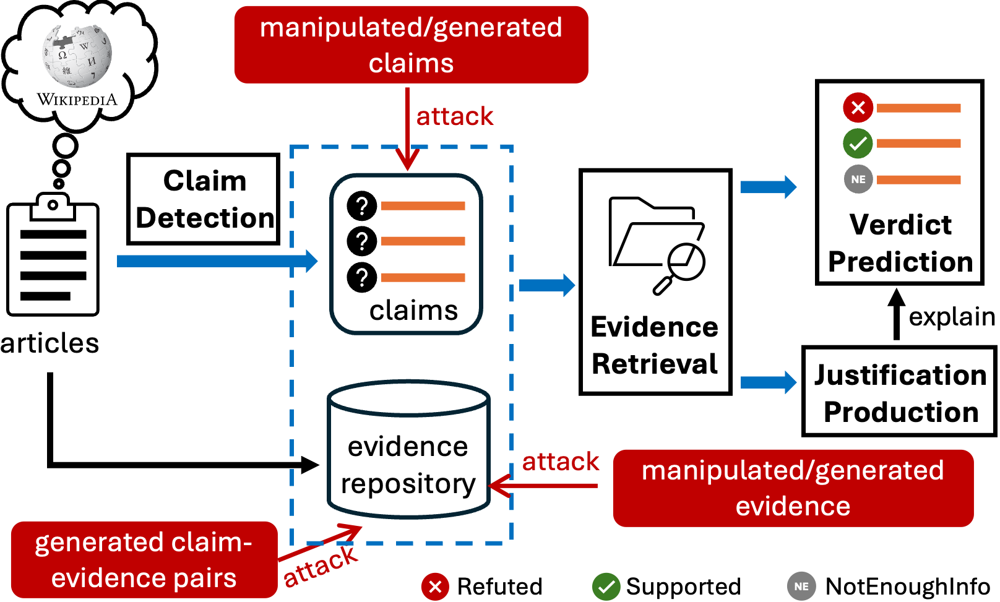
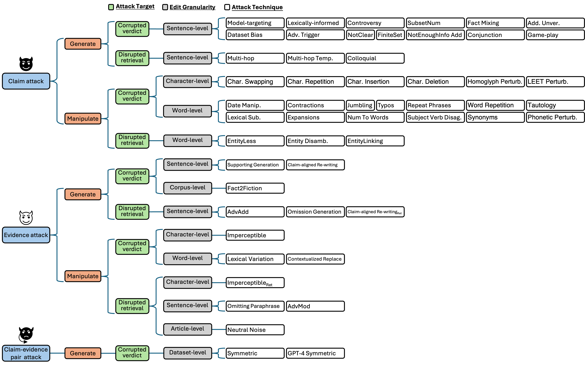

# Awesome Automated Fact-Checking Attacks
[](https://github.com/sindresorhus/awesome) [](http://makeapullrequest.com)   

Curated resources for our paper [**Adversarial Attacks Against Automated Fact-Checking: A Survey**](https://arxiv.org/abs/2509.08463), accepted to the Main Conference of EMNLP 2025. This repository includes relevant papers, implementations, and datasets.
The paper is now available on [arXiv](https://arxiv.org/abs/2509.08463). 

If you find our survey or this repository helpful in your research or projects, we kindly invite you to cite our paper:

```
@inproceedings{liu2025adversarial,
  title={Adversarial Attacks Against Automated Fact-Checking: A Survey}, 
  author={Fanzhen Liu and Alsharif Abuadbba and Kristen Moore and Surya Nepal and Cecile Paris and Jia Wu and Jian Yang and Quan Z. Sheng},
  year={2025},
  booktitle = {Proceedings of the 2025 Conference on Empirical Methods in Natural Language Processing (EMNLP)}, 
}
```

- [Awesome Automated Fact-Checking Attacks](#awesome-Deep-Community-Detection)
  - [Overview of Adversarial Attacks Against Automated Fact-Checking Systems](#overview-of-adversarial-attacks-against-automated-fact-checking-systems)
  - [Taxonomy](#taxonomy-of-adversarial-attacks)
  - [Category 1: Adversarial Claim Attacks](#category-1-adversarial-claim-attacks)
  	- [1.1 Generation-Based Attacks](#11-generation-based-attacks)
  	- [1.2 Manipulation-Based Attacks](#12-manipulation-based-attacks)
  - [Category 2: Adversarial Evidence Attacks](#category-2-adversarial-evidence-attacks)
  	- [2.1 Generation-Based Attacks](#21-generation-based-attacks)
  	- [2.2 Manipulation-Based Attacks](#22-manipulation-based-attacks)
  - [Category 3: Adversarial Claim-Evidence Pair Attacks](#category-3-adversarial-claim-evidence-pair-attacks)
  	- [3.1 Generation-Based Attacks](#31-generation-based-attacks)
  - [Target Datasets](#target-datasets)

------------
## Overview of Adversarial Attacks Against Automated Fact-Checking Systems


------------
## Taxonomy of Adversarial Attacks


------------
## Category 1: Adversarial Claim Attacks
### 1.1 Generation-Based Attacks
| Attack Technique | Target Dataset | Attack Target | Edit Granularity | Paper Title | Venue | Year| Materials | 
| :----: | :----: | :----: | :----: | ---- | :----: | :----: | :----: | 
| `Model-tagreting`, `Dataset Bias`, `Lexically-informed` |  FEVER 1.0 | Corrupted verdit | Sentence-level | Evaluating adversarial attacks against multiple fact verification systems | EMNLP | 2019 | [[Paper](https://aclanthology.org/D19-1292/)] [[Code](https://github.com/j6mes/emnlp2019-fever-attacks)] |
| `Adv. Trigger` | FEVER 1.0 | Corrupted verdict | Sentence-level | Generating label cohesive and well-formed adversarial claims | EMNLP | 2020 | [[Paper](https://doi.org/10.18653/v1/2020.emnlp-main.256)] [[Code](https://github.com/copenlu/fever-adversarial-attacks)] |
| `Controversy`,<br> `NotClear`,<br> `FiniteSet`,<br> `SubsetNum`,<br> `NotEnoughInfo Add` | FEVER 1.0 | Corrupted verdict | Sentence-level | FEVER breaker’s run of team NbAuzDrLqg | FEVER | 2019 | [[Paper](https://aclanthology.org/D19-6615/)] |
| `Fact Mixing` | FEVER 1.0 | Corrupted verdict | Sentence-level | GEM: Generative enhanced model for adversarial attacks | FEVER | 2019 | [[Paper](https://aclanthology.org/D19-6604/)] |
| `Conjunction`,<br> `Add. Unver.` | FEVER 1.0 | Corrupted verdict | Sentence-level | DeSePtion: Dual sequence prediction and adversarial examples for improved fact-checking | ACL | 2020 | [[Paper](https://aclanthology.org/2020.acl-main.761/)] [[Code](https://github.com/chridey/fever2-columbia)] |
| `Game-play` | FEVER 1.0 | Corrupted verdict | Sentence-level |  Fool me twice: Entailment from Wikipedia gamification | NAACL | 2022 | [[Paper](https://aclanthology.org/2021.naacl-main.32/)] [[Code](https://github.com/google-research/fool-me-twice)] |
| `Multi-hop`,<br> `Multi-hop Temp.` | FEVER 1.0 | Disrupted retrieval | Sentence-level | DeSePtion: Dual sequence prediction and adversarial examples for improved fact-checking | ACL | 2020 | [[Paper](https://aclanthology.org/2020.acl-main.761/)] [[Code](https://github.com/chridey/fever2-columbia)] |
| `Colloquial` | FEVER 1.0 | Disrupted retrieval | Sentence-level |  How robust are fact checking systems on colloquial claims?  | NAACL | 2021 | [[Paper](https://aclanthology.org/2021.naacl-main.121/)] [[Code](https://github.com/bckim92/colloquial-claims)] |

### 1.2 Manipulation-Based Attacks
| Attack Technique | Target Dataset | Attack Target | Edit Granularity | Paper Title | Venue | Year | Materials |
 :----: | :----: | :----: | :----: | ---- | :----: | :----: | :----: | 
| `Character Swapping`, `Character Repetition`, `Character Insertion`, `Character Deletion`, `Homoglyph Perturb.`,<br> `LEET Perturb.` | FEVER 1.0 | Corrupted verdict | Character-level | FactEval: Evaluating the robustness of fact verification systems in the era of large language models | NAACL | 2025 | [[Paper](https://aclanthology.org/2025.naacl-long.534/)] [[Code](https://github.com/TRAI-group/FactEval)] |
| `Date Manip.`,<br> `Lexical Sub.` | FEVER 1.0 | Corrupted verdict | Word-level | DeSePtion: Dual sequence prediction and adversarial examples for improved fact-checking | ACL | 2020 | [[Paper](https://aclanthology.org/2020.acl-main.761/)] [[Code](https://github.com/chridey/fever2-columbia)] |
| `Contractions`,<br> `Expansions`,<br> `Jumbling`,<br> `Typos`,<br> `Num To Words`,<br> `Repeat Phrases`,<br> `Subject Verb Disag.`,<br> `Word Repetition`,<br> `Synonyms`,<br> `Tautology`,<br> `Phonetic Perturb.` | FEVER 1.0 | Corrupted verdict | Word-level | FactEval: Evaluating the robustness of fact verification systems in the era of large language models | NAACL | 2025 | [[Paper](https://aclanthology.org/2025.naacl-long.534/)] [[Code](https://github.com/TRAI-group/FactEval)] |
| `EntityLess`,<br> `EntityLinking` | FEVER 1.0 | Disrupted retrieval | Word-level | FEVER breaker’s run of team NbAuzDrLqg | FEVER | 2019 | [[Paper](https://aclanthology.org/D19-6615/)] |
| `Entity Disamb.` | FEVER 1.0 | Disrupted retrieval | Word-level | DeSePtion: Dual sequence prediction and adversarial examples for improved fact-checking | ACL | 2020 | [[Paper](https://aclanthology.org/2020.acl-main.761/)] [[Code](https://github.com/chridey/fever2-columbia)] |

## Category 2: Adversarial Evidence Attacks
### 2.1 Generation-Based Attacks
| Attack Technique | Target Dataset | Attack Target | Edit Granularity | Paper Title | Venue | Year | Materials | 
| :----: | :----: | :----: | :----: | ---- | :----: | :----: | :----: | 
| `Supporting Generation`, `Claim-aligned Re-writing` | FEVER 1.0 | Corrupted verdit | Sentence-level | Fact-Saboteurs: A taxonomy of evidence manipulation attacks against Fact-Verification systems | USENIX Security | 2023 | [[Paper](https://www.usenix.org/conference/usenixsecurity23/presentation/abdelnabi)] [[Code](https://github.com/S-Abdelnabi/Fact-Saboteurs)] |
| `Fact2Fiction` | AVeriTeC | Corrupted verdit | Corpus-level | Fact2Fiction: Targeted poisoning attack to agentic fact-checking system | arXiv | 2025 | [[Paper](https://arxiv.org/abs/2508.06059)] |
| `AdvAdd` |  FEVER 1.0, SciFact, CovidFact | Disrupted retrieval | Sentence-level | Synthetic disinformation attacks on automated fact verification systems | AAAI | 2022 | [[Paper](https://ojs.aaai.org/index.php/AAAI/article/view/21302)] [[Code](https://github.com/Yibing-Du/adversarial-factcheck)] |
| `Omission Generation` |  FEVER 1.0, VitaminC, HoVer | Disrupted retrieval | Sentence-level | Fact checking with insufficient evidence | TACL | 2022 | [[Paper](https://doi.org/10.1162/tacl_a_00486)] [[Code](https://github.com/copenlu/sufficient_facts)] |
| `Claim-aligned Re-writing`<sub>Ret<sub> | FEVER 1.0 | Disrupted retrieval | Sentence-level | Fact-Saboteurs: A taxonomy of evidence manipulation attacks against Fact-Verification systems | USENIX Security | 2023 | [[Paper](https://www.usenix.org/conference/usenixsecurity23/presentation/abdelnabi)] [[Code](https://github.com/S-Abdelnabi/Fact-Saboteurs)] |

### 2.2 Manipulation-Based Attacks
| Attack Technique | Target Dataset | Attack Target | Edit Granularity | Paper Title | Venue | Year | Materials |
| :----: | :----: | :----: | :----: | ---- | :----: | :----: | :----: | 
| `Imperceptible` | FEVER 1.0 | Corrupted verdit | Character-level | Bad characters: Imperceptible NLP attacks | S&P | 2022 | [[Paper](https://ieeexplore.ieee.org/document/9833641)] [[Code](https://github.com/nickboucher/imperceptible)] |
| `Lexical Variation` | FEVER 1.0 | Corrupted verdit | Word-level | Generating natural language adversarial examples | EMNLP | 2018 | [[Paper](https://aclanthology.org/D18-1316/)] [[Code](https://github.com/nesl/nlp_adversarial_examples)] |
| `Contextualized Replace` | FEVER 1.0 | Corrupted verdit | Word-level | BERT-ATTACK: Adversarial attack against BERT using BERT | EMNLP | 2020 | [[Paper](https://aclanthology.org/2020.emnlp-main.500/)] [[Code]()] |
| `Imperceptible`<sub>Ret<sub> | FEVER 1.0 | Disrupted retrieval | Character-level | Bad characters: Imperceptible NLP attacks | SP | 2022 | [[Paper](https://ieeexplore.ieee.org/document/9833641)] [[Code](https://github.com/nickboucher/imperceptible)] |
| `Omitting Paraphrase` | FEVER 1.0 | Disrupted retrieval | Sentence-level | Fact-Saboteurs: A taxonomy of evidence manipulation attacks against Fact-Verification systems | USENIX Security | 2023 | [[Paper](https://www.usenix.org/conference/usenixsecurity23/presentation/abdelnabi)] [[Code](https://github.com/S-Abdelnabi/Fact-Saboteurs)] |
| `AdvMod` | FEVER 1.0 | Disrupted retrieval | Sentence-level | Synthetic disinformation attacks on automated fact verification systems | AAAI | 2022 | [[Paper](https://ojs.aaai.org/index.php/AAAI/article/view/21302)] [[Code](https://github.com/Yibing-Du/adversarial-factcheck)] |
| `Neutral Noise` | FEVER 1.0, Factual-NLI | Disrupted retrieval | Article-level | Improving evidence retrieval for automated explainable fact-checking | NAACL | 2021 | [[Paper](https://aclanthology.org/2021.naacl-demos.10/)] [[Code](https://github.com/algoprog/Quin)] |

## Category 3: Adversarial Claim-Evidence Pair Attacks
### 3.1 Generation-Based Attacks
| Attack Technique | Target Dataset | Attack Target | Edit Granularity | Paper Title | Venue | Year | Materials |
| :----: | :----: | :----: | :----: | ---- | :----: | :----: | :----: | 
| `Symmetric` | FEVER 1.0 | Corrupted verdit | Dataset-level | Towards debiasing fact verification models | EMNLP | 2019 | [[Paper](https://aclanthology.org/D19-1341/)] [[Code](https://github.com/TalSchuster/FeverSymmetric)] |
| `GPT-4 Symmetric` | FEVER 1.0 | Corrupted verdit | Dataset-level | Do we need language-specific fact-checking models? The case of Chinese | EMNLP | 2024 | [[Paper](https://aclanthology.org/2024.emnlp-main.113/)] [[Code](https://github.com/caiqizh/FC_Chinese)] |

## Target Datasets
- FEVER (FEVER 1.0) https://fever.ai/dataset/fever.html
- FEVER-adv https://github.com/j6mes/emnlp2019-fever-attacks
- FEVER 2.0 https://fever.ai/dataset/adversarial.html
- FEVER-sym https://github.com/TalSchuster/FeverSymmetric
- SciFact https://github.com/allenai/scifact
- CovidFact https://github.com/asaakyan/covidfact
- CHEF https://github.com/THU-BPM/CHEF
- Factual-NLI https://archive.org/details/factual-nli
- FoolMeTwice (FM2) https://github.com/google-research/fool-me-twice
- VitaminC https://github.com/TalSchuster/VitaminC
- SufficientFacts https://github.com/copenlu/sufficient_facts
- Hover https://hover-nlp.github.io/
- DeSePtion https://github.com/chridey/fever2-columbia
- PolitiHop-sym https://github.com/zcccccz/CausalWalk
- AVeriTeC https://fever.ai/dataset/averitec.html


